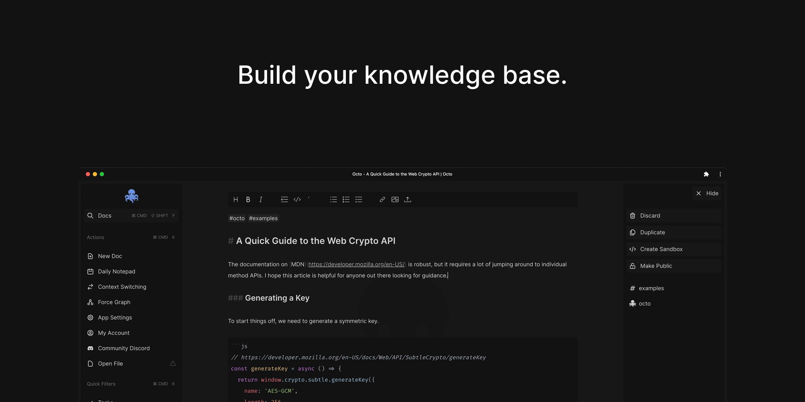

## Hi. I'm David (he/him). ✌🏻

A little bit about me.

- I'm a Senior Software Engineer at [Doximity](https://work.doximity.com).
- Check out my [public OSS roadmap](https://github.com/users/voraciousdev/projects/1/views/1) to see what I'm working on.
- I'm building a modern knowledge base tool at [octo.app](https://octo.app).
- I write about things I'm learning at [voracious.dev](https://voracious.dev).

### Connect with me

### Open Source work

Octo is an Open Source knowledge base tool that runs on any device in any (modern) browser.

